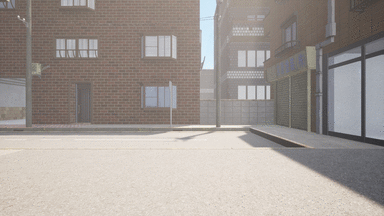
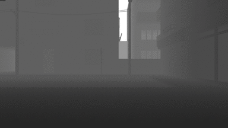
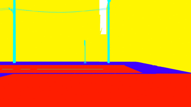
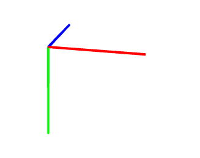
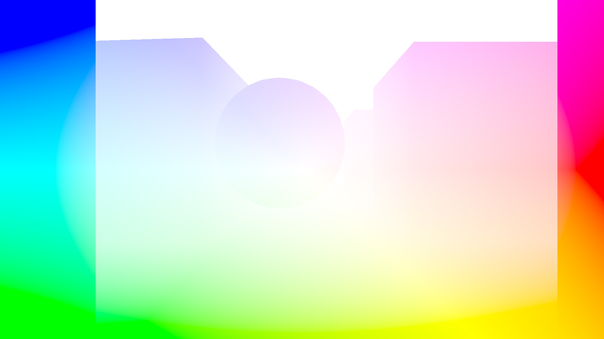
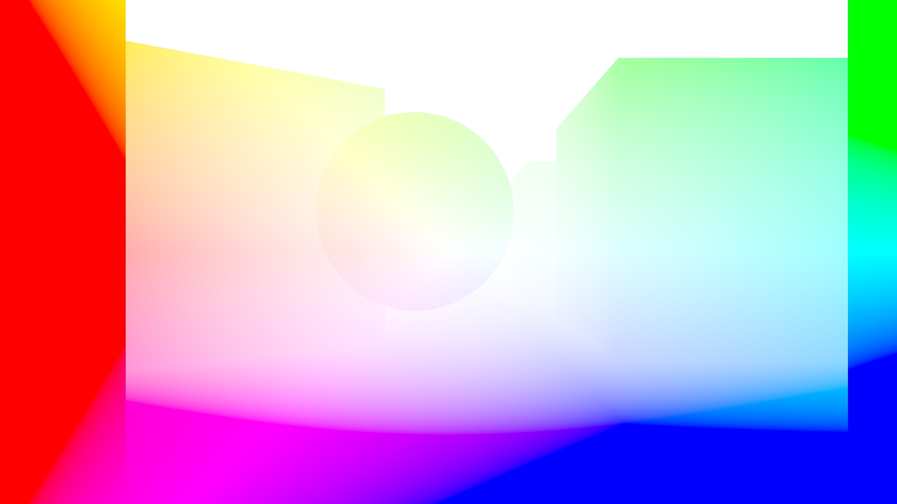

# EasySynth

EasySynth is an Unreal Engine plugin for easy creation of image datasets from a moving camera, requiring no C++ or Blueprint knowledge.

The plugin works by automatically starting the rendering of a user-defined level sequence, with different camera post-process settings. The outputs are camera poses, including position, rotation, and calibration parameters, together with the following image types:

|||
|-|-|
|Standard color images, as seen while creating the sequence in the editor||
|Depth images, representing the depth of a pixel using a grayscale value||
|Normal images, representing pixel normals using X, Y, and Z color values||
|Optical flow images, for more detail check out the optical flow section below||
|Semantic images, with every object rendered using the user-defined semantic color||
||Model credits: [Art Equilibrium](https://www.cgtrader.com/3d-models/exterior/street/japanese-street-6278f45d-3e1e-48db-9ca6-cce343baa974)|

## Installation

### Install by adding the plugin source code to your project

It works with both installed and engines built from code.

- Create a new Unreal Engine project with the path `<UEProject>`
  - <em>Optional</em>: Use some of the provided Unreal Engine templates that come with a prebuilt level layout
- Exit the editor
- Create and navigate to the `<UEProject>/Plugins` directory
- Clone this repo inside the `<UEProject>/Plugins` directory
- Reopen your project

## How to use

### Setup

- Create a project as described in the `Installation` section
- Create a level layout yourself, or look online for available levels that suit your needs
- Click the EasySynth button in the toolbar to open the EasySynth widget

### Semantic annotation

You can skip this step if you don't need semantic rendering.

The first step is to define the needed semantic classes, which you can modify at any point. To open the semantic classes editor, click the `Manage Semantic Classes` button. All modifications execute immediately. To close the editor, click the `Done` button.

This editor allows you to:
- Add a new semantic class
- Remove an existing semantic class
- Modify an existing semantic class name
- Modify an existing semantic class color

Next, you should assign semantic classes to all of the level actors. To do this:
- Select one or more actors of the same class in the editor window or by using the World Outliner
- Assign them a class by clicking on the `Pick a semantic class` button and picking the class

To toggle between original and semantic color, use the `Pick a mesh texture style` button. Make sure that you never save your project while the semantic view mode is selected.

### Sequence rendering

Image rendering relies on a user-defined `Level Sequence`, which represents a movie cut scene inside Unreal Engine. You only need the LevelSequence asset for rendering. Skip anything that has to do with the LevelSequenceActor. Here are some materials on how to get started:
- https://docs.unrealengine.com/4.27/en-US/AnimatingObjects/Sequencer/Overview/
- https://youtu.be/-NmHXAFX-3M

Setting up rendering options inside the EasySynth widget:


- Pick the created level sequence
- Choose the desired rendering targets using checkboxes
- Choose the output image format for each target
  - jpeg - 8-bit image output intended for visual inspection due to lossy jpeg compression,
  - png - 8-bit image output with lossless png compression, but with zero alpha, making the images appear transparent when previewed
  - exr - 16-bit image output with lossless exr compression, to open them with OpenCV in Python use `cv2.imread(img_path, cv2.IMREAD_ANYCOLOR | cv2.IMREAD_ANYDEPTH)`
- Choose the output images width and height
  - Choosing a different aspect ratio than the selected camera actor aspect ratio can result in an unexpected field of view in the output images
- Choose the depth infinity threshold for depth rendering
- Choose the appropriate scaling coefficient for increasing optical flow image color saturation
- Choose the output directory

Start the rendering by clicking the `Render Images` button.

<b>IMPORTANT:</b> Do not close a window that opens during rendering. Closing the window will result in the successful rendering being falsely reported, as it is not possible to know if the window has been closed from the plugin side.

### Workflow tips

- You can use affordable asset marketplaces such as [Unreal Engine Marketplace](https://www.unrealengine.com/marketplace) or [CGTrader](https://www.cgtrader.com/) to obtain template levels. Make sure to choose ones that provide assets in the Unreal Engine `.uasset` format.
- When semantic labeling levels with many assets, utilize the World Outliner as much as possible. Use the search option to filter similar actors and bulk-select them so that all of them are labeled in one click.
- If you want images to be spaced out more inside the level sequence (instead of being very close in order to provide a smooth video), you can set the custom level sequence FPS to a small value (1 FPS or lower) inside the Sequencer editor.
- To avoid adding keyframes manually, select the button with an image of a key inside the sequence editor toolbar. After you create the first keyframe, this will automatically add one at the current time for any moved asset.

## Outputs' structure details

### Camera pose output

If requested, the plugin exports camera poses to the same output directory as rendered images.

Output is the `CameraPoses.csv` file, in which the first line contains column names and the rest contain camera poses for each frame. Columns are the following:

| Column | Type  | Name | Description                |
| ------ | ----- | ---- | -------------------------- |
| 1      | int   | id   | 0-indexed frame id         |
| 2      | float | tx   | X position in meters       |
| 3      | float | ty   | Y position in meters       |
| 4      | float | tz   | Z position in meters       |
| 5      | float | qw   | Rotation quaternion W      |
| 6      | float | qx   | Rotation quaternion X      |
| 7      | float | qy   | Rotation quaternion Y      |
| 8      | float | qz   | Rotation quaternion Z      |
| 9      | float | fx   | Focal length X in pixels   |
| 10     | float | fy   | Focal length Y - same as X |
| 11     | int   | cx   | Halved image width         |
| 12     | int   | cy   | Halved image height        |

The coordinate system for saving camera positions and rotation quaternions is a right-handed coordinate system. When looking through a camera with zero rotation in the target coordinate system:
- X axis points to the right
- Y axis points down
- Z axis points straight away from the camera



Note that this differs from Unreal Engine, which internally uses the left-handed Z-up coordinate system.

Following is an example Python code for accessing camera poses:
``` Python
import numpy as np
import pandas as pd
from scipy.spatial.transform import Rotation as R

poses_df = pd.read_csv('<rendering_output_path>/CameraPoses.csv')

for i, pose in poses_df.iterrows():

    # Rotation quaternion to numpy array
    quat = pose[['qx', 'qy', 'qz', 'qw']].to_numpy()

    # Quaternion to rotation object
    rotation = R.from_quat(quat)

    # Rotation to Euler angles
    euler = rotation.as_euler('xyz')

    # Rotation to 3x3 rotation matrix, than to 4x4 rotation matrix
    mat3 = rotation.as_matrix()
    mat4 = np.hstack((mat3, np.zeros((3, 1))))
    mat4 = np.vstack((mat4, np.array([0.0, 0.0, 0.0, 1.0])))

    # Adding translation to the 4x4 transformation matrix
    mat4[:3, 3] = pose[['tx', 'ty', 'tz']].to_numpy()

    # Convert camera pose to a camera view matrix
    view_mat = np.linalg.inv(mat4)
```

### Optical flow images

Optical flow images contain color-coded optical flow vectors for each pixel. An optical flow vector describes how the content of a pixel has moved between frames. Specifically, the vector spans from coordinates where the pixel content was in the previous frame to where the content is in the current frame. The coordinate system the vectors are represented in is the image pixel coordinates, with the image scaled to a 1.0 x 1.0 square.

Optical flow vectors are color-coded by picking a color from the HSV color wheel with the color angle matching the vector angle and the color saturation matching the vector intensity. If the scene in your sequence moves slowly, these vectors can be very short, and the colors can be hard to see when previewed. If this is the case, use the `optical flow scale` parameter to proportionally increase the images saturation.

The following images represent optical flows when moving forward and backward respectively. Notice that all of the colors are opposite, as in the first case pixels are moving away from the image center, while in the second case pixels are moving toward the image center. In both examples the fastest moving pixels are the ones on the image edges.




Our implementation was inspired by the [ProfFan's](https://github.com/ProfFan) [UnrealOpticalFlowDemo](https://github.com/ProfFan/UnrealOpticalFlowDemo), but we had to omit the engine patching to make this plugin as easy to use as possible (i.e. not requiring the engine to be manually built). The shader code that renders optical flow is baked inside the optical flow post-process material. It can be accessed by opening the post-process material from the plugin's content inside the Unreal Engine editor.

<b>IMPORTANT:</b> Due to Unreal Engine [limitations](https://github.com/EpicGames/UnrealEngine/pull/6933) optical flow rendering assumes all objects other than the camera are stationary. If there are moving objects in the scene while rendering the sequence, the optical flow for these pixels will be incorrect.

## Contributions

This tool was designed to be as general as possible, but also to suit our internal needs. You may find unusual or suboptimal implementations of different plugin functionalities. We encourage you to report those to us, or even contribute your fixes or optimizations. This also applies to the plugin widget Slate UI whose current design is at the minimum acceptable quality.
